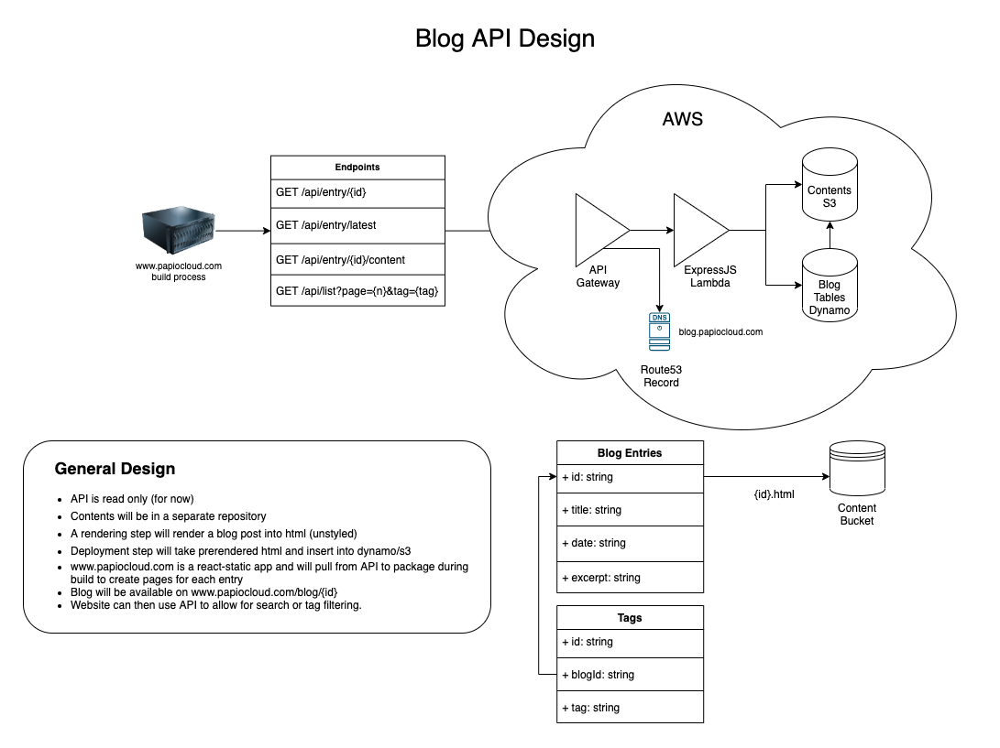

# Papio Blog API

API for accessing blog posts for www.papiocloud.com.  The API deploys to [AWS] using [AWS CDK].
The implementation of the API uses [ExpressJS] that is proxied as a [Lambda] through [API Gateway]
using the [aws-serverless-express] package.

## Design

[API Gateway]: https://aws.amazon.com/api-gateway/
[AWS]: https://aws.amazon.com/
[AWS CDK]: https://aws.amazon.com/cdk/
[aws-serverless-express]: https://www.npmjs.com/package/aws-serverless-express
[ExpressJS]: https://www.npmjs.com/package/express
[Lambda]: https://aws.amazon.com/lambda/
